# 👨‍💻 FOTE

<picture>
  <source media="(prefers-color-scheme: dark)" srcset="dark.svg">
  <source media="(prefers-color-scheme: light)" srcset="light.svg">
  
</picture>

  
  
  <!--  -->
  <!--  -->

  

  

---

## 🎓 About Me

🎯 **Frontend Developer** passionate about creating engaging web experiences

💾 **Learned Supabase Integration** through building a comprehensive learning platform (Masar X) - mastering database operations, authentication, file storage, and real-time features

🌟 Currently exploring the fascinating world of web development and AI

💡 Always eager to learn new technologies and improve my skills

---

## 🛠️ Tech Arsenal

### 💻 Languages & Frameworks

  
  
  
  
  
  
  
  
  
  
  

### 🎨 Styling & Design

  

### ⚙️ Tools & Technologies

  

---

## 📈 Activity Graph

  

---

## 🕹️ Contribution Fun

<picture>
  <source media="(prefers-color-scheme: dark)" srcset="https://raw.githubusercontent.com/fotedev/fotedev/output/pacman-contribution-graph-dark.svg">
  <source media="(prefers-color-scheme: light)" srcset="https://raw.githubusercontent.com/fotedev/fotedev/output/pacman-contribution-graph.svg">
  
</picture>

---

## 🌐 Socials

  
  
  
  

  
  
  

---

  

  <i>⭐️ From <a href="https://github.com/fotedev">FOTE</a> with ❤️</i>

